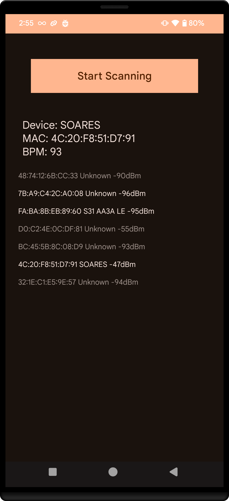
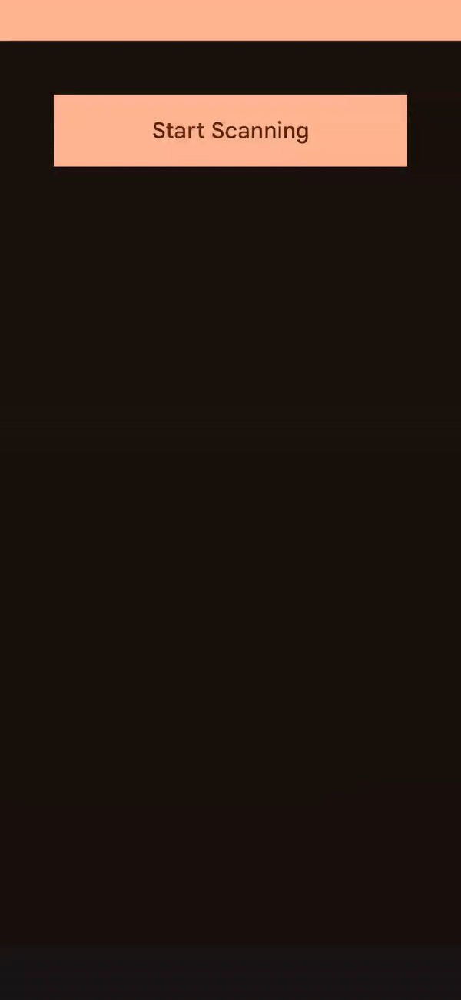

# Bluetooth LE Scanner App

Simple Bluetooth Low Energy (BLE) scanner built using Android and Jetpack Compose. It scans for nearby BLE devices and displays their details such as name, MAC address, RSSI, and connection status.

## Screenshot

<figure>
  
  <figcaption>Screenshot of Bluetooth LE Scanner App</figcaption>
</figure>

## Demo

Here is a demo of the Bluetooth LE Scanner app in action:

## Download
1. **Download the App**: Download the app from the [Releases tab](https://github.com/SoaresPT/AndroidBasics/releases/tag/BluetoothLEScanner)